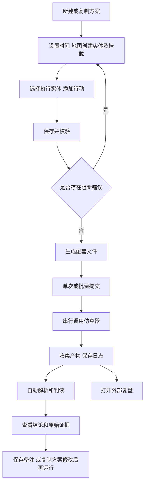

# 仿真自动化测试工具产品设计文档

版本：v1.0  
日期：2026-09-08  
适用范围：首版产品设计与开发验收

本产品帮助使用者通过地图和表单建立仿真想定、配置行动指令，生成配套输入文件，调用外部仿真器执行，收集产物后完成初步判读并启动外部复盘程序。首版以单机、单人操作和串行批量运行为基础，形成可以保存、重复执行和定位错误的完整流程。

设计依据按以下顺序采用：用户最新说明、需求描述、当前四份示例 JSON、模板说明文档。界面原型仅参考交互表达，不约束导航、页面数量和业务步骤。本文不设置用例审定、审批或出版流程；从新建方案即可开始工作。

当前示例明确的结构和类型直接采用。示例未明确的行为在本文中给出首版设计约定，可据此开发；外部程序路径和启动参数通过设置接入。本文替代上一版方案中“严格保留原型流程”的设计。

## 1 产品目标与首版边界

### 1.1 产品目标

用户不需要手工维护两份 JSON 中的实体 ID、目标引用、武器编码和时间范围。系统根据同一份方案数据生成想定及指令，执行前检查一致性，执行后将行动与输出证据关联，并明确显示成功、失败和无法判断的情况。

首版的最小使用路径是：新建方案 → 地图创建实体 → 配置挂载 → 添加行动 → 生成文件 → 运行 → 查看初判及复盘。批量运行通过选择多个方案完成。

### 1.2 首版范围

| 功能域 | 首版包含 | 首版边界 |
| --- | --- | --- |
| 方案管理 | 新建、保存、复制、搜索、归档、查看历史运行 | 一个方案对应一份想定和一份指令，不增加独立用例审批层 |
| 想定编辑 | 起止时间、双方阵营、四级分类筛选、模型选择、批量地图布点、实体属性及挂载 | 按当前精简想定字段生成，一个地图实体对应一个 trooplist 条目和一个主装备 |
| 行动编辑 | 多实体、多行动、目标选择、武器与数量、时间和示例扩展参数 | 使用行动映射配置，不自动规划行动或优化行动参数 |
| 文件生成 | 两份 JSON 预览、校验、导出和版本留存 | 只输出当前样例字段，产品内部元数据单独保存 |
| 仿真运行 | 单次运行、串行批量、取消、超时、失败隔离、重跑、日志 | 一个运行执行器；并发数默认固定为 1 |
| 结果判读 | 事件检索、逐行动初判、证据查看、异常标识、人工备注 | 规则无法证明结果时显示待复核，不推断成功 |
| 复盘 | 调用外部复盘程序打开本次产物 | 首版不开发内嵌三维回放器 |
| 配置扩展 | 模型目录、挂载目录、行动映射、判读规则、程序和目录配置 | 支持已有字段结构的配置扩展，不建设通用插件市场 |

环境气象、复杂组织层级、多人权限、自动生成测试用例、正式 Word 报告和分布式调度不进入首版。结果摘要与输入输出归档属于首版必备功能。

### 1.3 使用者与运行方式

主要使用者为需要构造和执行仿真验证的操作人员。日常操作使用中文名称；字段编码、完整 JSON 和日志在详情或高级区域查看。

首版以本机浏览器界面配合本地服务运行，外部仿真器及复盘程序由本地服务调用。部署操作系统随外部程序确定。地图资源支持本地配置；底图不可用时仍保留经纬网、已有实体及坐标输入能力。

## 2 核心对象与信息架构

### 2.1 核心对象

| 对象 | 用户理解 | 关系和规则 |
| --- | --- | --- |
| 方案 | 一次准备执行的仿真配置 | 包含基本信息、双方实体和行动；可持续编辑 |
| 实体 | 地图上的一个单位或平台 | 属于一个阵营，绑定一个模型，可拥有多种挂载和多条行动 |
| 挂载 | 实体拥有的武器、搭载飞机或其他配备 | 随实体保存；武器选择范围及数量受其约束 |
| 行动 | 一个实体在指定时间执行的一项指令 | 有独立 action_id，可选择对方目标和所需参数 |
| 生成版本 | 某一时刻生成的配套想定和指令 | 与方案修订号绑定；后续编辑不会修改已有文件 |
| 运行记录 | 某个生成版本的一次实际执行 | 保存运行输入、状态、日志、产物和判读结果 |
| 批次 | 一次提交的多条运行记录 | 按顺序串行执行，每条可独立成功、失败或取消 |

一个方案可以有多个生成版本和多次运行。界面始终区分“正在编辑的方案”和“某次运行使用的快照”。

### 2.2 一级导航

| 导航 | 内容 | 主要操作 |
| --- | --- | --- |
| 方案管理 | 方案列表、方案编辑工作区 | 新建、复制、编辑、生成、运行 |
| 运行中心 | 批次、运行列表、运行详情与结果 | 查看进度、日志、判读、重跑、复盘 |
| 模型与行动 | 四级分类模型目录、挂载目录、行动目录、判读规则 | 分类查看、新增或导入配置、重新加载 |
| 设置 | 文件目录、仿真器、复盘程序、地图与运行设置 | 保存配置、检查路径与参数 |

运行详情直接包含“概览、行动判读、事件、产物、日志”，无需再设独立的问题管理或文档中心。

### 2.3 主流程



生成和运行均可在没有判读规则的情况下进行；此时结果显示“待复核：未配置该行动判读规则”。缺少外部程序配置只阻断调用，不阻断方案编辑和文件导出。

## 3 页面设计

### 3.1 方案列表

列表展示方案名称、仿真时长、双方实体数、行动数、当前修订状态、最近运行状态、最近结论和更新时间。支持名称搜索，以及按草稿、有错误、已生成、有历史运行筛选。

页面主按钮为“新建方案”和“批量运行”；每行提供“编辑、复制、生成文件、运行、历史、归档”。历史运行状态和判读结论分别显示，不能用一个“成功”标签同时表示两者。

首次打开为空时显示：“还没有方案，新建方案后可在地图上布置实体。”提供“新建空白方案”和“从示例创建”两个入口。从示例创建导入当前想定结构，重新生成实例编号，并提供一条需要重新选择执行者、目标和武器的示例行动草稿，避免保留失效引用。

复制方案时复制实体、挂载及行动参数，重新生成方案和实体实例编号，整体重写全部引用并生成新的行动编号；不复制运行状态及历史结论。归档从默认列表隐藏方案，保留所有运行记录并支持恢复。

### 3.2 方案编辑工作区

采用一个工作区和四个页签：“基本信息、想定编辑、行动指令、生成与校验”。顶部固定显示方案名称、保存状态和“保存、校验、生成文件、运行”按钮。

```text
┌ 方案名称 / 修订号 / 已保存或未保存       保存  校验  生成文件  运行 ┐
│ 基本信息     想定编辑     行动指令     生成与校验                  │
├───────────────────────────────────────────────────────────────┤
│ 阵营与实体列表       地图与标记             当前实体属性         │
│ 搜索 / 新增          缩放 / 定位             名称 / 模型 / 坐标  │
│ 蓝方实体             地图点击创建            属性 / 所属 / 关系  │
│ 红方实体             拖动调整位置            查看该实体行动      │
├───────────────────────────────────────────────────────────────┤
│ 校验摘要：错误数量、提醒数量；点击问题定位字段                    │
└───────────────────────────────────────────────────────────────┘
```

提供显式保存。存在未保存修改时显示标识，离开工作区可选择保存或放弃。校验、生成和运行操作先保存当前合法数据；数据不足时允许保存草稿，同时显示不能生成的具体原因。正常保存不弹确认框。

### 3.3 基本信息

| 字段 | 类型及默认值 | 交互和约束 |
| --- | --- | --- |
| 方案名称 | 文本，默认“新建方案” | 必填，去除首尾空白，最长 60 个字符 |
| 方案说明 | 多行文本，默认空 | 可选，仅供工具内部保存，不写入想定 |
| 开始时间 | 日期时间，首次默认 2027-01-01 10:00:00 | 按样例格式保存，不自动进行时区转换 |
| 结束时间 | 日期时间，首次默认 2027-01-01 13:30:00 | 必须晚于开始时间 |
| 仿真时长 | 自动计算，以秒显示 | 由结束时间减开始时间得到 |
| 生成标题 | 系统生成，只读预览 | 生成版本的 ybnm；保留用户名称并附唯一后缀 |

调整仿真时长后，重新检查全部行动。超出范围的行动标红并列出，不自动裁剪用户设置的时间。修复后方可再次生成。

### 3.4 想定编辑

地图实体创建步骤为：选择“地图实体”、阵营和数量 → 按一级至四级分类筛选模型 → 选择是否作为编队 → 点击“批量布置” → 地图选择中心点 → 自动排布实体并打开第一个实体的属性。单次支持创建 1–50 个同型实体；未勾选“添加为编队”时创建普通实体。一次地图点击完成本批创建并退出布置模式。

模型记录保存 `FirstCfn`、`SecondCfn`、`ThirdCfn`、`ForthCfn`、`mxmc` 和 `mxlx`。添加实体时，模型选择项只显示模型名称，型号信息仅用于内部绑定和模型配置管理；系统通过当前四级分类及稳定标识确定所选模型，不通过显示名称反查编码。

模型目录按完整分类路径分组，例如“设施 / 陆上 / 机场 / 无”。添加模型时四级分类均为必填项，可使用样例值或录入新的分类值；导入配置同样要求这些字段完整。已有前端数据缺少分类时自动补齐为内置分类或“未分类”，不清空方案。

地图实体属性包含名称、阵营、模型、经度、纬度、高度和挂载实体清单。挂载实体属性包含名称、阵营、模型、所属主实体和挂载关系。实体编号及模型编码默认收起，可在详情查看。拖动地图实体同步坐标，表单修改坐标同步标记；所属挂载实体的位置和阵营随主实体更新。经度范围为 -180 至 180，纬度为 -90 至 90；高度必须为有限数值，以米显示。首版采用 WGS84 经纬度作为产品约定。

实体名称自动使用“模型名称-序号”，允许编辑。删除实体时，如果没有行动引用则直接移除并提供撤销；存在引用时展示受影响行动，提供“取消”或“删除实体及相关行动”。不保留无法解释的悬空引用。移除目标实体导致其他实体行动引用失效时，同时列入受影响清单。

已有行动引用的实体不直接切换模型或 `bzlx` 分支，界面引导复制建立新实体再重新选择行动。变更阵营后保留行动数据，但将不再符合目标阵营规则的行动标为错误。

#### 挂载实体

| 挂载关系 | 写入字段 | 首版操作规则 |
| --- | --- | --- |
| 武器 | `lstEquip[].ammo[]` | 选择武器分类、具体武器模型和数量，导出时按所属主实体及型号聚合 |
| 机库 | `lstEquip[].Hang[]` | 机库是挂载关系；选择飞机分类和具体飞机模型，导出时写入 ModelName、ModelType、count |
| 武器库 | `lstEquip[].AmDp[]` | 武器库是挂载关系；主实体已存在机库飞机时才可选择，库中添加具体武器模型 |

用户从统一“添加实体”入口选择“挂载到已有实体”，再选择所属主实体和挂载关系。机库和武器库本身不建立模型记录；机库关系中的实例是飞机实体，武器库关系中的实例是武器实体。挂载项与地图对象使用相同的模型目录、四级分类、实例 ID、复制和删除规则；列表中显示在所属主实体下方，不单独显示地图标记，也不能直接作为行动执行者或目标。

“武器”关系和“武器库”关系中的武器实体都作为行动可用库存来源；机库中的飞机不计入武器数量。武器库依赖机库：添加武器库武器前，所属主实体至少需要一个机库飞机；删除最后一个机库飞机前，必须先清空武器库。模型本身不附带写死的默认挂载数量。用户可批量添加同型号挂载实体；导出时将同一主实体、同一关系和同一型号的实例聚合为数量字段。

删除武器实体导致已有行动超量时，保存删除结果并将受影响行动标红。工具显示该型号已挂载数量及行动累计使用数量，帮助用户调整。

### 3.5 行动指令

左侧按执行实体分组，右侧为行动列表及编辑表单。列表展示行动名称、执行者、目标、开始及结束秒数、武器数量、校验状态。支持新增、复制、编辑、删除及排序；排序仅影响展示，不改变时间。

点击“新增行动”后，可多选同一阵营、同一具体型号的执行实体，选择一种行动，设置参数及每个实体的行动条数（1–50）。保存前显示展开摘要，例如“2 个执行实体 × 3 个行动，将创建 6 条指令”。保存后按实体逐条管理，每条只有一个执行者，并有独立 `action_id`。

首版不允许一次批量创建混合阵营的行动，避免一个目标选择同时承担相反阵营含义。不同阵营可分两次创建。

| 输入项 | 默认及选择范围 | 行为 |
| --- | --- | --- |
| 执行实体 | 当前阵营已创建实体，可多选 | 自动填入对应实体标识 |
| 行动 | 行动目录中的名称 | 初始提供“示例行动（000680）”，允许编辑、生成和提交运行 |
| 目标实体 | 对方阵营已创建实体 | 示例行动至少选择一个目标；不适用目标的扩展行动可配置为隐藏 |
| 开始时间 | 默认 0，单位秒 | 整数，范围为 0 至仿真时长 |
| 结束时间 | 默认仿真时长，单位秒 | 整数，范围为开始时间至仿真时长 |
| 使用武器 | 默认未启用 | 启用后，从执行者直接挂载或武器库中的武器实体中选择 |
| 武器数量 | 启用后默认 1 | 正整数，以每个执行实体的使用量计 |
| 扩展参数 | 默认折叠 | 按行动配置显示航路、区域、雷达、干扰等已有字段 |
| 判读规则 | 默认继承行动配置 | 未配置不阻断运行，结果显示待复核 |

多实体批量设置武器时，只展示所有所选实体共同拥有的型号，数量上限为各实体可分配数量的最小值。没有共同型号时允许保存不使用武器的行动；要分别用不同武器，可按实体单独编辑。

一个行动选择多个目标并使用武器时，每条武器使用记录选择一个目标，且必须属于该行动的目标列表。武器消耗量为所有使用记录数量之和。删除行动目标时，同时定位受影响的武器使用记录，修复后才能生成。

时间约束为 `0 ≤ start_time ≤ end_time ≤ T`。允许零时长行动；若后续某行动需要持续时间大于零，可在其配置中增加约束。同一实体的行动可以时间重叠，显示提醒；首版不自动调整时序，也不把所有重叠视为错误。

#### 示例扩展参数

| 参数区域 | 字段 | 用户输入形式 |
| --- | --- | --- |
| 武器途经点 | `launch[].way_points` | 地图或表格添加经纬高，自动生成从 0 开始的 order |
| 行动航路 | `route[].points` | 点列编辑；启用后至少一个点 |
| 行动区域 | `region[].points`、`region_type` | 多边形点列；至少三个不同点，类型默认 01 |
| 雷达角度 | `radar_angle` | 四个角度数值；启用后带入样例 0、10、0、60，起始不大于结束 |
| 干扰参数 | `jam_type`、`jam_mode` | 启用后默认 radar、block，选项来源于行动配置 |
| 补给参数 | `supply` | 比例及型号数量表；首版仅生成字段，不用预计补给放宽初始库存校验 |
| 关联分类 | `related_force`、`upstream_entity`、`downstream_entity` | 高级选项按配置选择，保持字符串数组结构 |

行动类型保存在本地 SQLite 的 action_types 表中，除 rule_type_code 和 xdmc 外，开始、结束时间固定必填且不入行动类型表，其余当前示例 action 与 ruleconfig 的一级字段均为布尔开关。前端按类型显示所有启用字段及其嵌套项目，启用即必填，禁用则不输出。类型开关与实例实际布尔值分别保存。初始 `related_force` 采用样例的 `["hs", "kd"]`，不赋予额外业务含义。

### 3.6 生成与校验

页面分为校验列表和双文件预览。校验列表展示级别、对象、问题和定位按钮；预览页签为“想定 JSON”和“指令 JSON”，同时显示最终文件名和保存目录。

校验结果分为“错误”和“提醒”。错误阻断生成及入队；提醒允许继续。未配置判读规则、行动时间重叠属于提醒；缺失实体、错误目标、超库存、非法时间属于错误。外部程序未配置只阻断运行。

“生成文件”先保存并校验，再从同一份数据生成两份文件，全部成功后形成一个生成版本。生成失败时不发布半成品版本。修改方案后显示“文件已过期，请重新生成”，原生成版本保留在历史中。

提供“导出想定”“导出指令”“导出配套文件”操作。配套下载包含两个子目录，以保留两个文件相同的名称。JSON 预览只读，常规修改回到表单完成。

点击“运行”时，若当前方案有修改，则自动保存、校验并生成最新版本；若已有当前有效版本则直接使用。不会要求用户重复执行已经完成的步骤。

### 3.7 运行中心

批次列表展示总数、排队数、运行数、运行完成数、运行异常数及取消数；判读通过、不通过、待复核另行统计。点击批次进入运行列表。

每条运行展示方案名称、运行编号、提交时间、开始时间、耗时、阶段、结论和操作。执行中提供日志与取消；结束后提供结果、产物、重跑和复盘。

批量提交前对所选方案逐项检查，并展示可运行与不可运行的清单。存在错误时按钮明确写为“提交可运行的 N 项”，点击后只提交这些项，其他项保留错误原因。不静默忽略选中的失败方案。

队列按提交顺序运行。单项失败、超时或判读异常不会阻断后续项。取消排队项立即生效；取消运行项先显示“取消中”，收到终止结果后显示“已取消”。取消批次同时取消剩余排队项及当前运行项。

不提供虚构的进度百分比。外部程序不能报告进度时显示当前阶段和已耗时。重跑使用原运行的输入快照和配置快照，分配新的运行编号及 `ybnm`；用户若需要使用最新模型配置，应回到方案重新生成运行。

### 3.8 运行详情与结果

顶部并列显示“运行状态”和“判读结论”，提供“打开复盘、重跑、导出结果摘要”按钮。

| 页签 | 内容 |
| --- | --- |
| 概览 | 方案及输入版本、时间范围、运行耗时、程序信息、判读数量和异常摘要 |
| 行动判读 | 每条行动的执行者、目标、预期事件、是否发现、执行结果、原因和证据 |
| 事件 | 按事件码、实体、目标和时间筛选，分页显示原始事件及相关帧 |
| 产物 | 想定、指令、实体态势、事件态势、日志及结果摘要的文件信息 |
| 日志 | 时间顺序的运行日志、调用失败信息、解析及判读错误 |

点击一条行动展开证据，显示原始字段、仿真相对秒、所属文件、行号或对象序号。长 ID 在列表中缩写，悬浮和详情显示全文，支持复制。

人工复核可以追加“结论和说明”，自动初判保持不变。修改已有人工结论时保存修改时间和历史值。初判没有证据时，人工通过也必须带说明，不能反向修改原始输出。

复盘按钮在有可用态势产物且已配置复盘程序时启用。只传入当前运行的明确文件路径，不搜索其他方案的最新文件。打开失败在运行详情显示原因，不改变自动判读结果。事件跳转到复盘时间点作为后续能力，首版不承诺外部程序支持。

### 3.9 模型与行动及设置

模型和行动目录支持查看、搜索、导入配置文件、重新加载。导入先检查结构和唯一编码，成功后整体替换或按明确选择追加；错误时保留当前有效配置并列出原因。配置更新对新建或主动更新的方案生效，历史快照不变。

第一阶段将装备型号目录保存在本地 SQLite 的 `equipment_models` 表中。一条记录对应一个具体型号，`mxlx` 为唯一主键，`mxmc` 作为前端显示名称且允许重复；四级分类、模型编码及生成想定所需的模型字段与该型号保存在同一条记录。前端启动时通过接口读取目录，新增和批量导入成功后直接写入数据库。

| 设置分组 | 必要配置 |
| --- | --- |
| 文件 | 想定输入根目录、指令输入根目录、运行归档根目录 |
| 仿真器 | 可执行路径、工作目录、参数列表、输出目录规则、超时、结束判据 |
| 复盘程序 | 可执行路径、工作目录、参数及需要的态势文件类型 |
| 地图 | 底图来源、本地资源位置、默认中心和缩放范围 |
| 判读 | 行动与事件映射、成功失败条件、输出 ID 映射方式 |

路径设置提供“检查配置”，检查存在性、访问能力和占位符完整性，不启动仿真。默认超时为 3600 秒，可修改；它是实际运行等待时间，不是仿真时长。串行队列不需要用户配置并发数。

## 4 核心业务规则

### 4.1 方案标题和版本

用户输入的名称可重复。生成时构造唯一标题 `名称_日期时间_唯一后缀`，例如 `基础验证_20260908_153000_a7c92f`，写入想定与指令的 `ybnm`，并用于两份文件名。文件名清理规则作用于生成标题，界面保留原始名称并展示处理后的结果。

同一有效生成版本重复点击导出不改变 `ybnm`；修改后重新生成、主动再次运行或重跑均分配新标题。首次运行使用当前尚未执行的生成版本；再次运行从其快照派生新版本，仅同步更新两份输入的 `ybnm` 及相应文件路径，保留实体和行动参数。原生成版本始终不变。唯一性由服务端持久化检查并在冲突时重试，不能只依赖秒级时间。

一次提交中的重复点击和请求重试视为同一次操作，返回已有运行编号，不重复启动程序。用户在前一次提交完成后主动点击“再次运行”才创建新的运行记录。

名称最长 60 个字符，生成文件名不含路径分隔符和系统保留字符。Windows 保留文件名、末尾空格或句点等情况由生成器统一处理，不将用户名称直接拼接为任意路径。

### 4.2 实体标识

按当前样例生成 33 位十进制字符串形式的 `trooplist.llbznm`，检查整个想定内唯一。`zyId` 使用样例的 `模型编码_8位编号_8位编号_5位编号` 形式，生成后同样检查唯一性。所有 ID 全程使用字符串。

实体创建时同时准备两类 ID。有效行动引用按以下规则选择：`bzlx` 为 null、空串或空白串时，取该主装备 `zyId`；其他情况取 `trooplist.llbznm`。空 `bzlx` 导出统一使用 null。

实体改名、移动和编辑挂载不改变 ID。复制实体生成新 ID。方案内所有执行者、目标、策略引用均通过同一个实体目录解析，不由多个表单各自生成编号。

`trooplist.sjllbznm` 首版按样例形状分配独立的 33 位辅助编号，不在产品中提供父子编队编辑，也不将其解释为当前地图实体引用。该处理属于首版兼容约定。装备级 `llbznm` 保留模型模板值，与部队级实例 ID 分开处理。

### 4.3 阵营与模型映射

首版约定蓝方映射 `dwsxnm=01`、输出 Side/side 为 Blue，红方映射 `dwsxnm=02`、输出为 Red。当前样例未明确给出两种阵营编码体系的对应关系，因此这是一项可配置的产品约定。

每个模型条目分别保存 `mxmc`、`mxlx`、`mxnm`，例如 MX01 对应的模型编码仍为 CMRM0300000000001，不能把两字段合并。模型是否属于哪个阵营由实体决定，初始模型均可在任一阵营创建。

指令编成所需的 `entity_type` 从模型目录的 `command_entity_type` 读取，缺省取该模型 `mxlx`。初始示例模板可为 MX01 配置 ZB01；该对应是首版配置约定，不宣称为已有引擎码表。显示名称使用实体所选模型名称。

### 4.4 指令结构与数量

指令顶层 `rules` 是数组，首版只放一个方案对象，共享 `fanm` 和 `ybnm`。`fanm` 使用新生成的 32 位十六进制字符串。该对象内 `ruledata` 也是数组，按执行实体及完全相同的策略值分组，其 `action` 数组包含该组全部行动，`ruleconfig` 数组放一个策略对象；未启用任何策略时为 []，没有行动的实体不生成空指令。

每条行动的 `executor` 只有一个元素。多选实体只是编辑便利，最终展开为每个实体自己的行动。`action_id` 在创建或复制行动时生成，并在同一生成版本中保持稳定；重复保存不重建行动 ID。

`formation_struct` 为可选项，未配置或删除全部条目时不输出。配置时默认对应主装备：`entity_count=1`，`entity_name` 为模型名称，`entity_type` 为指令模型映射值，`formation_id` 由实体创建时分配并保持稳定。`mount` 与 `formation_struct` 同处 executor 对象下，按当前指令样例层级输出。

### 4.5 武器和引用校验

行动只能使用执行者直接挂载或武器库中实际存在的武器实体。指令的 `weapon_type` 和 `mount_type` 采用所选模型的类型值，`mount.num` 采用两个来源中该型号武器实体的合计数量，`launch.weapon_num` 采用本条计划使用数量。

同一实体同一武器的全部显式消耗行动累计使用量不得超过初始库存。已保存行动占用计划分配量；编辑某条行动时先扣除其原分配再计算上限，避免重复占用。未保存的批量编辑一次性计算整批分配，不逐条乐观放行。

首版的库存校验检查显式指令计划。外部仿真器的自动行为或补给可能改变实际库存，不能据此承诺运行中一定不会耗尽。配置中可设置策略以适应实际引擎；判读依据仍来自输出。

目标 ID、武器记录目标和策略目标都必须来自当前方案。当启用 `target` 时，`launch.target_id` 必须属于当前行动 `target` 列表；未启用时仍必须指向当前对方实体；`target_child_id` 可填写子单元字符串，也可保持为空串。需要机场的自动返回策略只有选择当前方案中配置为机场的实体后才能启用。

## 5 文件生成规范

### 5.1 想定字段

| 字段位置 | 首版生成规则 |
| --- | --- |
| 顶层 cjlx | 固定使用当前样例 DEMO_TYPE，配置可替换 |
| startTime、endTime | 来自方案时间，格式 YYYY-MM-DD HH:MM:SS |
| ybnm | 本生成版本的唯一标题 |
| yb | 始终生成 01、02 两方；无实体的一方 trooplist 为空数组 |
| yb、data、resource 中 dwsxnm | 同一方保持一致 |
| trooplist 的 bzmc | 实体名称 |
| bznm、glph、jznm | 分别保持样例空串、空串和 null |
| bzlx、llbznm、sjllbznm | 按模型配置和本文 ID 规则生成 |
| jd、wd、gc | 地图或属性输入的经纬高，使用数值类型 |
| lstEquip | 一个主装备，sl 固定为 1 |
| 主装备型号名称与编码 | 来自模型目录，保留当前样例各字段 |
| 主装备 zyId | 自动生成资源实例编号 |
| 主装备 bzmc、llbznm | 从模型模板带入，默认分别为模型条目的 lxzymc、mxlx |
| AmDp、Hang、ammo | 来自挂载编辑；没有条目时输出空数组 |

不生成当前想定样例中没有的环境、气象、区域环境、链路配置等字段。工具中的说明、校验状态、运行编号和判读规则不混入想定 JSON。

### 5.2 指令字段

| 字段 | 首版生成规则 |
| --- | --- |
| fanm、ybnm、ruledata | 按方案及实体分组规则生成 |
| action_id、rule_type_code | 编号启用时取系统生成的实例 ID；行动代码始终取所选类型 |
| executor、formation_struct、mount | 按类型启用；引用绑定执行者，编成及挂载初值由实体派生并允许编辑 |
| target | 由已选对方实体生成 target_id，不添加样例未出现的 target_name |
| launch | 启用武器时输出；未启用时省略该可选分支 |
| start_time、end_time | 固定必填的相对秒整数，始终输出，不由类型开关控制 |
| related_force | 初始从示例行动配置读取 hs、kd |
| route、region、radar_angle、jam、supply | 按启用的参数区域生成原样例结构，未启用的分支省略 |
| upstream_entity、downstream_entity | 配置启用时输出；不将示例分类串误认为当前实体 ID |
| ruleconfig | 数组，按执行者和相同策略分组，输出启用字段的用户值；无启用字段时为 [] |

按照指令生成补充需求，类型中 false 字段不显示且不输出，true 字段按示例结构填写。下表仅为表单初值，启用的策略字段均由用户配置。已有行动保存类型快照，目录修改只影响之后新增的行动。

| 策略字段 | 首版默认值 |
| --- | --- |
| is_auto_attack | true，沿用样例，可在高级策略中修改 |
| is_auto_return | auto_return=false、airport_id=""；避免复制样例中不存在的机场 |
| is_task_continue | true |
| is_hidden_maneuver、is_consider_environment | false |
| is_auto_deterrence、is_deterrence_auto_return | false |
| radar_detect_mode | 初值 detect_mode=scan，target_list 为默认对方目标；可逐条编辑 |
| intercept_strategy | 1.0 |

顶层和所有启用分支只输出当前样例已有的键。输入文件采用 UTF-8 严格 JSON，无注释、尾逗号、NaN 或 Infinity；字段类型遵循样例，不把所有数值改成字符串。

### 5.3 路径与快照

需求中的两份同名 JSON 在本产品中解释为想定输入和指令输入，两者必须存入不同目录。根目录写入配置。

```text
scenario_root/{ybnm}.json
command_root/{ybnm}.json
runs_root/{run_id}/
  input/scenario/{ybnm}.json
  input/command/{ybnm}.json
  raw/实体态势原文件
  raw/事件态势原文件
  normalized/                  需要格式转换时使用
  manifest.json
  run.log
  verdict.json
  summary.html
```

运行提交后冻结输入、配置版本和文件摘要。外部程序只消费本次运行对应文件，不读取可继续编辑的草稿。原始产物保留原格式；转换文件单独保存，复盘适配器选择其支持的文件版本。

原始路径、运行编号和行号属于证据索引信息，不写入外部输出文件。每次运行目录唯一，成功、失败和取消都保留已产生的日志与产物。

## 6 运行与外部集成

### 6.1 状态定义

| 运行状态 | 含义 | 后续状态 |
| --- | --- | --- |
| 排队中 | 输入快照已保存，等待执行 | 启动中、已取消 |
| 启动中 | 正在调用仿真器 | 运行中、运行失败、取消中 |
| 运行中 | 外部程序尚在执行 | 收集产物、运行失败、已超时、取消中 |
| 收集产物 | 程序结束，检查并归档本次文件 | 判读中、产物异常 |
| 判读中 | 解析文件并逐行动应用规则 | 已完成、判读异常 |
| 取消中 | 已请求停止，等待确认 | 已取消、运行失败 |
| 已完成 | 执行和判读流程结束 | 可查看、复盘、重跑 |
| 运行失败、已超时、已取消、产物异常、判读异常、已中断 | 对应阶段异常终止 | 可查看已有资料或重跑 |

“已完成”不代表行动通过。即使全部行动不通过或待复核，只要处理流程正常结束，运行状态仍为已完成。服务重启时，无法恢复并确认的在途运行标为已中断，不无条件自动重启外部程序。

### 6.2 仿真器接口约定

本地服务提供独立适配接口：启动、查询状态、取消、收集产物。首版优先采用可执行程序加参数列表，参数模板支持想定路径、指令路径、输出目录、运行编号及 ybnm 占位符。实际命令行开关由设置填写，不预设外部程序一定接受某个开关。

正常完成需要同时满足：启动和退出协议成功、约定输出已产生、输出属于本次运行、文件可完整解析，以及配置的完成条件满足。当前样例 `simulatorStatus=1` 不作为固定完成标识。事件流是稀疏记录，不要求最后一条事件的时间等于仿真结束时间。

支持运行独立输出目录时直接隔离；只能写固定目录时，由串行适配器识别并归档本次产物后再放行下一项。仅凭文件存在或大小短暂稳定不能判定完成，更不能读取旧文件冒充本次结果。

程序启动失败、非零退出和超时均展示可读原因及原始日志。首版不自动反复重试。重跑由用户发起，以便保留每次异常事实。

### 6.3 复盘接口约定

复盘适配器接收运行编号、实体态势路径、事件态势路径，以及可选的想定和指令路径。配置决定传入单文件、多个文件还是运行目录。首版支持打开指定运行，不要求暂停、倍速或跳转等远程控制能力。

复盘程序由用户点击启动。判读可独立执行；复盘打开失败不回滚运行结果。批量完成不会自动弹出多个复盘窗口。

### 6.4 无外部程序时的产品行为

仍可完成建模、行动编辑、校验、文件导出和已有输出的本地解析预览。提供“查看输出样例”入口，仅用于展示示例事件、实体帧和字段结构，不写入真实运行历史，不产生“本方案通过”的结论。

运行按钮明确提示缺少的程序或路径配置。开发中的模拟执行仅作为显式测试模式，页面和结果摘要标注模拟，不与真实运行统计混合。

## 7 判读规则与证据

### 7.1 读取当前样例

当前事件态势文件为每行一个完整 JSON 的 NDJSON；实体态势文件为两个连续的多行 JSON 对象。读取器支持这两种形式，并统一为帧记录。无需改变原始文件扩展名。

事件列表读取 `eventList`，实体列表读取 `entityList`。`timeStamp` 按相对秒数值比较，帧时间按日期时间处理；不用字符串字典顺序比较数值。`ECActionState`、`location`、`WeaponMountList` 等按需二次解析，空串和 null 不视为成功数据。

JSON 损坏、内嵌字段解析失败和格式不支持均保留文件位置及原文。可展示已解析部分，但不得将不完整数据的缺失事件直接判为完整证据下的失败或通过。

### 7.2 行动与事件关联

先限定运行，再关联实体，最后关联行动。输入 ID 与输出 ID 完全一致时直接匹配；外部程序发生重编号时使用该次运行的显式 ID 映射。找不到映射时显示“无法关联实体”，不按名称或数组下标猜测。

行动关联优先使用配置明确的实例字段。当前样例 `ECActionState.ActID=CMRE000000004` 不等于输入 action_id，`instCode` 也不能直接当作输入实例 ID。

没有实例字段时，依据行动配置的事件码、执行者、目标及时间窗口做组合匹配。必须唯一归属才作为该行动的确定证据；多条同类行动争用同一事件时标记待复核。事件的 srcID、targetID 在不同类型中可能代表不同角色，规则要明确“执行者在哪里、受影响对象在哪里”。

首版默认判读窗口为行动的开始至结束秒数，两端包含；配置可设置前后容差，默认均为 0。重复上报事件按稳定事件 ID 去重；没有 ID 时按规范化原始记录及帧位置保留，并避免同一条证据被分配给多个行动。

### 7.3 初始规则与结论

初始事件目录保留当前样例可直接读出的两项：CMRE000000001“某报告事件”和 CMRE000000003“产生实体毁伤事件”。CMRE000000002 在当前事件样例中是 instCode，CMRE000000004 出现在实体行动状态中，分别保留其实际字段角色，不照搬原型的事件名称映射。

示例行动 000680 默认不绑定成功规则。它可以正常生成和运行；系统展示运行产生的事件，并对行动显示“待复核：未配置判读规则”。这是一项明确的首版行为，不要求产品开发等待完整行动码表。

判读配置至少包含行动代码、事件代码集合、对象字段角色、时间窗口、成功条件、失败条件和关联方式。支持存在性检查、数值比较、字符串等值、明确行动终态，以及 AND/OR 条件组合；不执行任意脚本。

| 情况 | 是否发现对应事件 | 行动结果 | 判读结论 |
| --- | --- | --- | --- |
| 唯一匹配且满足成功规则 | 是 | 成功 | 通过 |
| 唯一匹配且满足失败规则 | 是 | 失败 | 不通过 |
| 找到事件但无终态或无结果规则 | 是 | 未知 | 待复核 |
| 输出完整、规则要求必有事件且触发条件已满足，但未找到 | 否 | 未执行或缺失 | 不通过 |
| 无对应规则、ID 不明或多重匹配 | 未知 | 未知 | 待复核 |
| 运行或产物错误，不能完整检查 | 未知或局部已知 | 无法完成判读 | 未判读或判读异常 |

成功和失败条件同时成立且规则没有明确的终态优先级时，结论为待复核。状态型判据按同一实例时间序列解释，不因较早出现 success 就忽略后续的终态或冲突证据。`running` 只表示运行中；某个毁伤事件不自动证明任意一条指令成功。

方案总体结论按行动汇总：有任意确定不通过则总体不通过；没有不通过但存在待复核则总体待复核；全部行动通过才总体通过。存在未判读行动且无确定失败时总体为判读不完整。即使已有确定失败，其他未判读项仍单独显示，不被汇总结论掩盖。

### 7.4 结果留存

每条行动保存 action_id、执行者、目标、规则版本、检索窗口、初判、原因、证据位置及人工复核记录。运行摘要记录输入及输出文件摘要，确保报告与对应产物一致。

结果摘要输出 JSON 和可读 HTML，包括运行状态、方案信息、行动结论、错误及证据索引。首版不生成正式测试方案、审定表或出版文档。

## 8 配置扩展约定

| 配置 | 必要信息 | 更新后的行为 |
| --- | --- | --- |
| equipment_models | 以 mxlx 为主键，保存显示名、各模型编码、四级分类、默认 bzlx 和指令类型映射 | 新具体型号写入 SQLite 后加载到前端分类选择列表 |
| mount_relations | 关系显示名及写入分支 | 新关系出现在添加挂载实体的关系选择中 |
| actions | 行动名称、rule_type_code、参数定义、默认值、库存消耗规则、空分支策略 | 新行动按已有字段组件生成表单 |
| judgements | 行动事件映射、对象角色、成功失败条件、时间及实例关联 | 后续判读采用明确规则，历史结果不自动改写 |
| runtime | 路径、参数、超时、输出格式、完成条件及 ID 映射来源 | 新运行调用所选程序配置 |

配置导入必须检查必填字段、重复键、未知字段类型和引用。名称允许重复，稳定配置标识必须唯一。普通使用者只接触已加载的目录；配置文件中才使用编码与字段路径。

当前方案保存引用配置的快照。目录更新后，用户可以点击“更新方案配置”，预览哪些模型、挂载或行动受到影响；更新后重新校验并使已有生成版本过期。相同参数类型的新条目仅更新配置即可，新参数类型或全新判读能力需要扩展实现。

## 9 异常与交互反馈

| 触发条件 | 提示示例 | 产品处理 |
| --- | --- | --- |
| 没有实体或行动 | “至少创建一个实体并添加一条行动后生成。” | 允许保存草稿，阻断生成 |
| 示例行动无对方目标 | “请先创建对方实体，再选择目标。” | 定位目标字段 |
| 武器累计超量 | “实体 A：某型弹药已挂载 4 个，计划使用 5 个，超出 1 个。” | 阻断生成并定位相关行动 |
| 时间超限 | “行动 2 的结束时间超过仿真时长。” | 保留输入值，标红 |
| 模型目录为空 | “尚未加载模型，请到模型与行动导入配置。” | 禁止地图布置，其他页面可用 |
| 文件写入失败 | “无法写入想定目录，请检查目录配置。” | 保留草稿，不形成有效生成版本 |
| 仿真器未配置 | “请在设置中配置仿真器路径和启动参数。” | 阻断调用，允许导出 |
| 程序异常退出 | “仿真器退出异常，查看日志了解原因。” | 记录运行失败，后续队列继续 |
| 产物缺失或残留 | “未找到可确认属于本次运行的事件态势。” | 产物异常，不使用历史文件代替 |
| 无判读规则 | “该行动未配置判读规则，结果待复核。” | 保留事件和产物，允许复盘 |
| 复盘打开失败 | “复盘程序未能打开本次产物。” | 显示调用错误，不改变初判 |
| 底图加载失败 | “底图暂不可用，可继续使用坐标和经纬网编辑。” | 保留实体及坐标操作 |

错误以文字、图标和颜色共同表达，不能只依赖红绿色区分。正常保存与生成使用页内状态反馈，不连续弹窗。耗时操作显示当前阶段，可操作按钮根据状态启用，避免重复提交。

## 10 验收标准

### 10.1 需求覆盖

| 需求 | 产品落点 | 验收编号 |
| --- | --- | --- |
| 地图创建实体及 trooplist，模型前端加载、名称编码映射 | 想定编辑、模型目录、想定生成 | A01—A04 |
| llbznm 或 zyId 唯一，配置挂载及 ybnm | 实体标识、挂载编辑、生成标题 | A03、A05、A09 |
| 多实体多行动、ruledata、executor_id、目标及武器约束 | 行动编辑、指令展开和校验 | A06—A08 |
| 同名两文件、配置根目录、外接仿真器、批量 | 生成预览、设置、运行中心 | A09—A12 |
| 调用外部复盘 | 运行详情、复盘适配器 | A13 |
| 判断行动是否发生和成功，错误标识 | 行动判读、证据、异常反馈 | A14—A18 |

### 10.2 首版验收用例

| 编号 | 操作与条件 | 预期结果 |
| --- | --- | --- |
| A01 | 不经过审定页面，新建空白方案 | 可直接进入地图与指令编辑 |
| A02 | 加载两个同 mxmc、不同 mxlx 的样例模型 | 可区分选择，导出各自正确 mxlx 和 mxnm |
| A03 | 创建多实体、复制实体，并覆盖 bzlx 非空与空分支 | ID 唯一，executor_id 分别取 llbznm 和 zyId |
| A04 | 地图选点、拖动实体、输入坐标 | 地图与表单双向一致，生成 jd、wd、gc 正确 |
| A05 | 先添加机库飞机，再批量添加武器库武器，并测试删除最后一个机库飞机 | 输出分支和聚合数量正确；无机库时不能添加武器库，武器库未清空时不能删除最后一个机库飞机 |
| A06 | 2 个同阵营执行实体批量创建 3 个行动 | 形成 2 个 ruledata、6 条 action 和 6 个唯一 action_id |
| A07 | 选择同阵营目标、删除被引用实体、缩短仿真时间 | 错误被定位，生成和入队受阻，历史运行不变 |
| A08 | 库存 4，分别配置两条数量 2 与 3 的行动 | 累计超量被拦截；调整为 2 与 2 后通过 |
| A09 | 生成、再次导出、修改后生成、复制或重跑 | 双文件 ybnm 一致且分目录；版本命名规则和历史隔离正确 |
| A10 | 提交一条正常和一条故意退出异常的运行 | 日志完整、异常单独记录、队列继续 |
| A11 | 取消排队项、取消运行项、触发超时 | 状态正确，未确认终止前不显示已取消 |
| A12 | 保留旧产物，再制造本次产物缺失 | 不把旧文件作为新运行成功结果 |
| A13 | 对某次运行点击复盘，并测试错误程序路径 | 正确打开对应产物；失败时不改变判读结论 |
| A14 | 读取当前事件和实体样例 | 分别解析出 2 帧；内嵌 JSON 正确展示 |
| A15 | 用样例行动 000680 运行且未配置判读规则 | 显示待复核，不预置通过，不阻断生成及调用 |
| A16 | 注入唯一关联的成功、失败、running 三类证据 | 分别得到通过、不通过、待复核 |
| A17 | 同一事件可对应两条行动，或实体 ID 无法映射 | 结果待复核，不能重复计为两条通过 |
| A18 | 损坏输出、中途截断、缺失必需事件 | 区分解析异常、证据不完整与完整证据下的事件缺失 |
| A19 | 更新模型和判读配置后查看旧运行并重跑 | 旧快照及结论不变；重跑使用原快照并保留来源关系 |
| A20 | 配置真实仿真器和复盘程序，执行一个最小方案 | 从地图建实体到生成、执行、产物、判读及复盘形成真实链路 |

工具功能验收可以使用可控测试进程覆盖成功、失败、超时和损坏输出。A20 必须使用真实外部程序；行动成功结论需要与真实接口匹配的判读规则。样例预览和模拟模式不能替代真实集成验收。

## 11 实施分段与交付内容

| 阶段 | 交付内容 | 用户可完成的操作 |
| --- | --- | --- |
| 第一阶段 | 模型及行动初始配置、方案编辑、地图、挂载、校验、双文件生成 | 不手写 JSON 完成一个方案并导出 |
| 第二阶段 | 程序配置、串行队列、快照、日志、取消及产物收集 | 单次及批量调用外部仿真器 |
| 第三阶段 | 输出解析、行动判读、证据页面、复盘及摘要 | 完成运行结果检查与复盘 |
| 第四阶段 | 异常验收、配置扩展验证、真实程序联调 | 完成首版验收用例并交付 |

首版随产品交付样例模型和挂载目录、示例行动 000680 配置、实际字段角色一致的事件目录、目录及外部程序配置模板，以及简明操作说明。默认方案可编辑和生成，程序接口配置完成后可执行；判读规则逐项补充即可增加自动判定覆盖。

## 12 本版明确采用的设计约定

| 项目 | 本版决定 |
| --- | --- |
| 原型地位 | 仅作参考，不复制审定、出版或完整页面流程 |
| 操作入口 | 直接新建方案，围绕想定、行动、运行、结果组织 |
| 模板范围 | 当前四份示例的字段和格式；解释性说明不扩张字段范围 |
| ID | zyId 使用实际拼写，部队 ID 使用当前样例的 33 位格式 |
| 阵营 | 默认 01 对应 Blue、02 对应 Red，可配置 |
| 实体粒度 | 一次地图创建一个 trooplist 和一个 sl=1 的主装备 |
| 挂载实体 | 机库添加飞机，存在机库后武器库才能添加武器；直接武器和武器库武器用于指令库存，各关系分别聚合导出 |
| 指令展开 | 按执行实体和相同策略分组 ruledata，一条 action 一个执行者 |
| 未命名行动码 | 用“示例行动（000680）”展示，可生成运行，无规则则待复核 |
| 批量 | 多方案串行执行，异常隔离，不设置人工审定关卡 |
| 复盘 | 用户点击调用外部程序，与自动判读独立 |
| 不确定的结果 | 保留原始证据并显示待复核，不输出无依据的成功 |

## 13 依据文件

- [需求描述.md](/Users/hjt/Projects/自动化测试/需求描述.md)
- [示例想定模板](/Users/hjt/Projects/自动化测试/模版文档/示例_想定模版.json)
- [示例指令模板](/Users/hjt/Projects/自动化测试/模版文档/示例_指令模版.json)
- [示例实体态势](/Users/hjt/Projects/自动化测试/模版文档/示例_实体态势模版.json)
- [示例事件态势](/Users/hjt/Projects/自动化测试/模版文档/示例_事件态势模版.json)
- [模板说明](/Users/hjt/Projects/自动化测试/模版文档/仿真通用模版总结.md)
- [前序最小流程分析](/Users/hjt/Projects/自动化测试/最小可跑通流程方案.md)，流程范围以本文及用户最新说明为准。


### 行动构建实现补充（2026-09-10）

行动目录、字段开关、动态嵌套表单、批量编号和后端生成已实现。详细操作与当前边界见 [行动指令构建说明](行动指令构建说明.md)。文档中的真实仿真运行、外部复盘及文件目录发布仍为后续范围。
