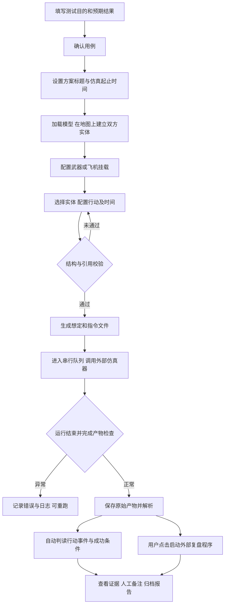

# 仿真自动化测试最小可跑通流程方案

后续设计说明：用户已明确原型仅作参考。最新功能范围与交互以 [产品设计文档 v1.0](/Users/hjt/Projects/自动化测试/产品设计文档_v1.0.md) 为准，本文保留为前序分析记录，其中保留原型审定和出版流程的建议不再适用。

建议先实现单机运行的最小版本：保留原型的流程顺序，通过地图和表单构造想定及行动，由本地服务生成文件、串行调用外部仿真器，收集产物后自动判读，并支持启动外部复盘程序。首个真实闭环只接入一组已验证的模型和一种行动。

本方案依据当前需求、v0.6 界面原型、四份 JSON 样例及 Word 模板说明分析。当前目录没有可执行仿真器、复盘程序或原型提到的 `pipeline/` 实现，因此本文是实施方案；真实运行能力仍需通过外部程序联调验收。

## 一 最小版本的范围

按原型保留“需求描述 → 用例审定 → 想定构建 → 批量运行 → 结果判读 → 过程文档”的顺序。将指令编辑放在想定构建中，将复盘入口放在结果判读中。

| 环节 | 首版实现 | 后续扩展 |
| --- | --- | --- |
| 需求与用例 | 手工输入测试目的、用例标题、预期行动及成功条件，点击确认 | 自然语言生成测试方案和用例、复杂审定流程 |
| 想定构建 | 时间、双方实体、地图选点、武器和飞机挂载、文件预览 | 复杂编队、多层组织、环境和气象编辑 |
| 指令构建 | 多选执行实体、选择行动、配置参数，按实体展开指令 | 更多行动类型、复杂协同与冲突调度 |
| 批量运行 | 多个用例进入串行队列，保存日志，失败隔离、手动重跑 | 并行仿真、多机调度 |
| 复盘与判读 | 调用现有复盘程序；显示事件证据、初判和人工备注 | 嵌入式三维回放、事件定位联动、复杂效果评估 |
| 过程文档 | 保存一次运行的输入、输出、日志、JSON 结果和基础 HTML 报告 | 正式 Word、Excel 文档包和出版模板 |
| 配置管理 | 模型、行动、判读和程序路径从配置加载；提供查看与重新加载 | 完整在线配置编辑和版本管理界面 |

首版保留模型扩展、行动扩展、仿真器替换和复盘程序替换四个接口。模型配置在这里指仿真装备模型目录，前端显示 `mxmc`，生成时使用对应的字段值。

## 二 一条完整操作流程



首次验收采用一个用例、双方各一个实体、一个执行者、一种已确认行动。用例明确填写“哪条行动应该发生、何时发生、什么证据代表成功”。具体模型、行动码和成功证据以仿真器提供方给出的可运行基准为准。

单用例通过后，复制得到第二个方案并批量执行，验证唯一命名、产物隔离和单项失败后队列继续运行。多实体和多行动的编辑能力在首版保留，真实联调从这条最短路径开始。

## 三 当前资料中需要先处理的差异

以下是本次直接检查文件得到的结果，不能将这些独立样例直接组合为真实可运行用例。

| 检查项 | 当前情况 | 方案处理 |
| --- | --- | --- |
| 方案编号 | 想定 `ybnm` 为 `1-DEMO02_AB12CD34_01`，指令为 `1-DEMO01_AB12CD34_01` | 两份输入共享一次生成的 `ybnm` |
| 实体引用 | 指令使用 `EXEC_A_1`、`ZB01_2` 等，未对应想定中的实体 ID | 所有执行者、目标和策略中的实体引用由实体目录生成 |
| 模型编码 | 同一装备的 `mxlx=MX01`，`mxnm=CMRM0300000000001` | 两个字段分别保存在配置中，不互相覆盖 |
| 武器引用 | 想定示例为 `AMMO01`、数量 4；指令为 `WQ01`、数量 10 | 从执行者实际挂载生成选择项，并校验编码及数量 |
| 资源 ID 拼写 | 需求写 `zyid`，JSON 实际键名是 `zyId` | 内部统一实体标识，导出使用样例的 `zyId`，待正式接口确认 |
| ID 长度 | 说明文字称 38 位；当前想定的两条 `trooplist.llbznm` 均为 33 位 | ID 全程按字符串处理；长度和生成格式留在适配配置中 |
| 输入格式 | 当前想定、指令样例都可以直接按标准 JSON 解析 | 首版输出严格 JSON，无需因说明中的旧格式描述引入宽松解析器 |
| 态势格式 | 事件文件是两行 NDJSON；实体文件是两个连续的多行 JSON 对象 | 输入识别 NDJSON 与连续 JSON 对象；内部统一为逐帧记录 |
| 输入与输出 ID | 想定、指令、两类态势之间没有形成完整的一致 ID 链 | 联调确认保留 ID 还是重编号，必要时保存显式映射 |
| 行动状态关联 | `ECActionState.ActID` 示例为 `CMRE000000004`，并非输入的 `action_id` | 不将两个字段直接等同，需明确关联方式 |
| 界面运行结果 | 原型由定时器模拟运行，`computeVerdicts()` 使用预设数据计算结论 | 复用页面流程，接入真实进程状态和产物解析 |

Word 说明含有明确标为“推测”的字段释义，原型也包含演示编码。字段结构以当前需求及样例为实现起点；编码含义、成功条件和外部调用协议必须用真实接口验证。

## 四 想定和指令如何生成

### 1 模型目录与实体创建

建立一个 `models.json`，每个条目保存：`mxmc`、`mxlx`、`mxnm`、`lxzymc`、`lxzynm`、默认 `bzlx`、适用模板以及允许的挂载配置。前端通过接口读取目录，增加同类模型时更新配置并重新加载即可。

一次地图选点创建一个 `trooplist` 条目，首版每条放一个主要 `lstEquip`，其 `sl=1`。这样点击对象、行动执行者和库存归属可以明确对应。前端提供位置调整、删除、名称和阵营编辑，地图选点后显示经纬高供核对。

实体 ID 统一通过一个解析函数获取：

```text
entity_id(entity) =
  bzlx 非空：trooplist.llbznm
  bzlx 为 null、空串或空白串：该实体对应的 lstEquip.zyId
```

ID 在创建实体时生成，在编辑位置、名称和行动时保持稳定。两个阵营共用唯一性检查。首版内部采用唯一字符串，导出格式由 ID 适配器控制，正式格式确认后再固定。编辑阵营、模型或挂载后，使受影响的指令重新校验；已有运行快照不变。

需要区分 `trooplist.llbznm` 与 `lstEquip.llbznm`：样例中前者是长编号，后者是 `MX01` 一类值。按各自模板角色导出，不能把所有同名字段替换为一个随机 ID。`sjllbznm` 等父级引用也需要明确含义，不能生成不存在的父级来凑字段。

阵营在内部保存为稳定值，导出时通过配置映射到各层 `dwsxnm`；与输出 `Blue/Red` 的对应关系需确认。地图坐标系也需与仿真器核对，首版可暂按 WGS84 经纬度设计。

### 2 武器和飞机挂载

界面支持选择型号和数量，序列化时分别写入样例已有的 `AmDp`、`Hang`、`ammo` 结构。当前资料不足以确认所有模型中这三者的业务关系，因此每种模型配置明确“哪类挂载写哪个字段、哪个字段作为行动可用库存”。

不要把三个字段的数量直接相加。同一库存若在多个字段表现，内部只计一次。挂载飞机是否能作为独立行动执行者，需要额外的实体实例和 ID 规则；首版先完成挂载配置，不自动推断飞机已经成为独立执行实体。

对会消耗库存的行动，按每个执行者分别校验：单条使用量不能超过挂载量，同一方案内各条行动累计计划使用量也不能超过初始库存。首版不自动计算补给。多选实体时，“数量”按每个实体使用量处理，并在界面明确标注。

### 3 行动目录与展开规则

建立一个 `actions.json`，每条包含行动名称、`rule_type_code`、可用模型、参数字段、默认值、字段是否必填、库存是否消耗及对应判读规则。已有参数类型可采用选择框、数字、时间、目标选择和地图点列。

初始可载入示例代码 `000680` 供模板预览，但其真实行动名称及语义尚未确认，应标记为未验证。正式运行至少需要一种已确认可执行的行动；未知行动保持可扩展配置，不猜测代码含义。

采用以下首版约定：`rules` 内一个方案对象；每个执行者对应一个 `ruledata`，其中 `action` 保存该实体的多条行动，`ruleconfig` 保存该实体的策略配置。每条行动仅含一个执行者。这个分组需要在首个基准用例中验证仿真器支持。

例如选中 2 个实体并配置 3 个适用行动，会展开为 2 个 `ruledata`、6 条 `action`，每条生成独立的 `action_id`。该约定符合需求中“为每个实体创建指令”的描述，也便于库存校验和逐条判读。

生成器负责如下约束：

- `executor_id` 取该执行实体的 `llbznm` 或 `zyId`；用户不手填。
- 行动需要目标时，只显示已创建的对方阵营实体；无需目标的行动按模板输出空值或省略该分支。
- `target[].target_id` 和 `launch[].target_id` 都检查引用，避免保留示例中的不同目标。
- `T = endTime - startTime`，要求 `T > 0`，且 `0 ≤ action.start_time ≤ action.end_time ≤ T`；端点是否需要更严格约束由行动定义决定。
- `action_id` 在本次指令文件中唯一；`fanm` 可先按说明生成 32 位十六进制值，真实语义由适配器确认。
- `formation_struct`、`mount` 和武器使用参数从实体配置生成，不复制示例中无关的类型码。
- 只生成当前行动需要的参数分支。固定值来自该行动的已验证模板。
- `airport_id`、`target_list` 等策略字段同样需要有效实体引用。含实体 ID 的字段不属于可以任意写死的常量。

若行动需要航路或区域，使用地图点列编辑并校验点数和顺序。首个接入行动选择必需参数较少、且已有成功基准的类型。

### 4 校验与文件导出

前端给出即时提示，后端在生成和提交队列时执行权威校验。错误信息定位到具体实体或行动，例如“实体 A 的行动 2：计划使用量超过剩余可分配库存”，并返回字段路径。

校验至少覆盖字段类型、必填项、实体和行动 ID 唯一、全部引用存在、目标阵营、模型与行动适配、挂载数量、时间范围、两文件 `ybnm` 一致。数量和经纬度保持样例的数值类型，长 ID 保持字符串，不把全部字段转为六位小数字符串。

想定只生成当前精简样例的字段，首版不增加说明超集中的 `kjhjList`、气象、区域环境等配置。每次生成先形成两份文件及清单，全部写入成功才允许入队，避免只写出一份就启动仿真。

## 五 文件命名与外部程序接口

需求原约定“两个文件均为 `{ybnm}.json`”，现更新为：想定输入 `{ybnm}.json`、指令输入 `{ybnm}_xdzl.json`（指令带 `_xdzl` 后缀，不与想定重名）。两份输入仍分目录存放；仿真输出名称另由仿真器适配配置决定。

建议由用户可读标题加唯一后缀生成最终方案标题并写入 `ybnm`，例如 `基础行动验证_20260908_a7c92f`。生成后展示完整标题。后端负责去除路径非法字符、限制长度、持久化唯一性检查，冲突时重新生成；不能仅依赖秒级时间戳。

```text
配置中的 scenario_root/
  {ybnm}.json                   想定输入
配置中的 command_root/
  {ybnm}_xdzl.json              指令输入
配置中的 runs_root/
  {run_id}/
    manifest.json              用例、ybnm、程序及配置版本、路径、输入摘要
    input/scenario/{ybnm}.json  本次运行的想定快照
    input/command/{ybnm}_xdzl.json 本次运行的指令快照
    raw/                       仿真器原始产物，保留原名
    normalized/                必要时转换的标准逐帧文件
    run.log
    verdict.json
    report.html
```

不同方案、重跑均新建 `run_id`；建议重跑也生成新的 `ybnm` 并同步写入两份输入，以兼容外部程序按文件名识别任务的情况。保留来源运行关系及原始输入快照，业务参数与随机种子在支持时保持一致。

配置项包括两个输入根目录、运行根目录、仿真器可执行路径、工作目录、参数列表、超时、产物位置和格式、完成判据、复盘程序路径和参数。参数用占位符绑定本次路径；命令行开关必须来自外部程序的实际说明。

仿真器适配器提供如下内部接口，这些是工具的设计接口，不表示外部程序已支持同名 API：

```text
start(run_context)       启动并返回本次运行句柄
poll(handle)            返回运行状态及可用进度
cancel(handle)          终止本次执行
collect(handle)         返回原始产物路径和完成性检查结果
replay.open(run_context) 调用复盘程序打开选定运行
```

最短实现路径是同一台机器上的命令行调用。若仿真器实际使用服务 API、目录监听或专用配置文件启动，只修改适配器。若仅支持人工 GUI 操作，自动运行环节还需要该程序提供可控启动接口或单独评估 GUI 自动化，不能声称已有真实闭环。

仿真器存在固定输出目录时，首版串行运行：适配器必须识别本次新产物，完成归档后才启动下一项，避免读取历史输出。独立输出目录可用时，优先为每次运行分配目录。

进程正常退出后，还需检查约定产物存在、能完整解析、属于本次运行，以及符合已确认的结束协议。`simulatorStatus=1` 在样例中没有已确认的完成含义，不能据此判定结束；文件大小暂时不变也不足以证明全部输出已写完。

运行异常、超时和取消单独记录并保留日志。进度只有在仿真器提供可靠进度或当前仿真时间时展示百分比，否则显示“运行中”和已用时间。服务重启后，将未能确认状态的运行标为中断，不自动显示成功或直接重复启动。

复盘入口只消费已归档产物，默认由用户点击启动，避免批量任务自动打开多个窗口。复盘程序打不开时保留单独错误，已完成的自动判读仍可查看。带界面的复盘程序需要由有桌面会话的同机服务启动。

## 六 初步判读怎样避免误判

每种行动绑定一条 `judgement_rules.json` 配置，定义发生事件、成功证据、失败证据、对象角色、时间窗口和证据关联方式。仅配置行动名称与代码不足以完成成功判读。

处理顺序如下：

1. 读取原始事件帧和实体帧，兼容当前样例的两种流格式，保留文件、行号或对象序号。损坏内容显式报错，不能静默跳过后输出通过。
2. 按字段需要解析 `ECActionState` 等内嵌 JSON 字符串，将时间字符串转为数值并按仿真时间排序。空串、JSON `null` 和缺字段分别处理。
3. 先限定当前运行，再通过已确认的 ID 映射关联执行者及目标。事件中的来源、受影响对象、目标字段可能随事件类型改变，由判读规则指定角色。
4. 优先使用仿真器确认的行动实例关联标识。若没有，则按实体、事件类型、目标和时间窗匹配；只有能唯一归属时才认定为该行动的证据。
5. 找到事件后继续检查明确的成功或失败条件。状态型行动查看相应实例的终态，不能看到中间的 `running` 就判为成功。
6. 输出每条 `action_id` 的初判、原因和原始证据；人工结论与自动初判分别保存。

同一实体同类行动时间重叠、同一事件可以匹配多条行动，或者输入与输出 ID 无法对应时，标记“待复核”。同一成功事件不能被重复计入多条行动。当前样例的 `ActID`、`instCode` 都没有证明可直接回指 `action_id`。

| 观察结果 | 行动初判 | 显示内容 |
| --- | --- | --- |
| 事件唯一对应行动，且满足明确成功条件 | 通过 | 成功字段、时间、执行者及证据位置 |
| 事件唯一对应行动，且满足明确失败条件 | 不通过 | 失败原因及证据 |
| 已结束且输出完整，应触发条件已满足、事件规则明确，但未找到必需事件 | 不通过 | 缺失事件及检索窗口 |
| 找到相关事件，但没有成功或失败终态 | 待复核 | 已发生，结果证据不足 |
| 行动映射未知、对象不明、触发前提无法判断或存在多重匹配 | 待复核 | 具体缺少哪项证据 |
| 程序异常、产物缺失或解析损坏 | 未判读或判读不完整 | 运行错误；可展示已有局部证据 |

运行状态与测试结论分开保存：正常运行可以得到“不通过”，工具也可能已完成处理但结论是“待复核”。事件发生也不能自动推出行动成功，更不能自动推出后续效果成功。当前事件样例只有普通报告和毁伤示例，缺少一种行动从指令到成功终态的完整证据链。

## 七 建议的技术组成

采用本机浏览器界面、本地 Python 服务、SQLite 和文件目录的单体结构。界面沿用原型布局，将演示数据替换为接口数据；用户访问本机地址即可操作。首版部署以仿真器实际支持的操作系统为准。

| 组成 | 选择 | 承担的工作 |
| --- | --- | --- |
| 前端 | 原有 HTML、CSS、JavaScript，按功能拆分模块 | 流程导航、表单、地图、列表、校验提示 |
| 地图 | Leaflet，库资源随工具提供 | 地图选点、实体标记、按行动需要编辑点列 |
| 本地服务 | Python + FastAPI | 配置读取、实体与行动管理、校验、文件生成、结果接口 |
| 持久化 | SQLite + 文件系统 | 任务、用例、运行状态与结论存数据库；大体积态势存文件 |
| 运行调度 | 单个后台执行器，串行队列 | 启动、超时、取消、日志、产物收集和重跑 |
| 扩展接口 | 模型配置、行动配置、判读规则、两个程序适配器 | 配置增加同类内容，适配新增外部协议 |

FastAPI 可以提供静态文件服务，因此可让界面和 API 由同一本地服务提供。[FastAPI 官方说明](https://fastapi.tiangolo.com/tutorial/static-files/)

Leaflet 提供地图、标记和点击事件，可用于选点建实体；底图来源单独配置，有离线要求时准备本地底图，不能把联网加载成功当作部署前提。[Leaflet 官方入门](https://leafletjs.com/examples/quick-start/)

Python 的 `subprocess` 支持进程启动、输出和退出码获取，可作为本地程序适配器基础；参数以列表传递，并分别处理工作目录、日志和超时。[Python 官方说明](https://docs.python.org/3/library/subprocess.html)

不将完整态势读入数据库或浏览器。后端逐帧解析并生成摘要，界面分页读取事件证据，原始文件交给复盘程序。首版前端通过轮询获取运行状态即可。

内部数据只需要清楚区分任务、用例、想定草稿、行动、运行快照和判读结果。运行快照记录配置版本和输入摘要，后续编辑草稿不改变历史报告。新增模型若使用已有字段结构，可以只加配置；新增行动若出现新的参数类型或成功判据，则可能需要新增表单组件或判读处理器。

## 八 开发顺序与验收

| 阶段 | 主要工作 | 完成判据 |
| --- | --- | --- |
| 1 接口基准 | 确认一组真实可运行输入、调用方式、输出和成功条件；形成模型及行动配置 | 能独立说明怎样启动，以及哪项输出证明本条行动成功 |
| 2 文件闭环 | 实体模型、行动展开、校验和生成器 | 自动生成两份一致的严格 JSON，字段和引用检查通过 |
| 3 操作闭环 | 原型页面接数据，加入地图选点、挂载和行动编辑 | 用户不手改 JSON 即可生成首个有效用例 |
| 4 调用闭环 | 队列、进程适配器、日志、超时、取消、产物隔离 | 两项串行执行；一项失败不阻断后续；重跑不覆盖历史 |
| 5 判读与复盘 | 流解析、事件关联、判据、复盘入口、基础报告 | 每条结论可定位证据，外部复盘打开对应产物 |
| 6 真实验收 | 用真实仿真器执行基准用例并覆盖异常路径 | 至少一条实际行动从创建、执行到成功证据和复盘完整贯通 |

接口资料尚未齐备时，可以先推进阶段 2 和 3，并用独立的模拟进程验证阶段 4、5 的文件与错误处理。模拟模式在界面和报告中明确标识；其成功只表示工具链路可用。

关键验收用例包括：

- `bzlx` 非空与为空两种实体分别正确使用 `llbznm`、`zyId`，跨阵营 ID 不重复。
- 地图创建实体、编辑挂载后生成相应字段；多实体、多行动展开后的引用和 ID 正确。
- 同阵营目标、悬空引用、超时域、单条及累计超库存均在调用前被拦截。
- 两份输入分目录存放、`ybnm` 一致，指令文件带 `_xdzl` 后缀不重名；同名标题和连续重跑不会覆盖历史文件。
- 程序非零退出、超时、缺失产物、历史残留和解析错误均有独立状态与日志。
- 完整成功、明确失败、必需事件缺失、只有中间状态、ID 无法关联、多条行动争用证据能够得到不同且可解释的判读。
- 真实复盘程序能打开本次真实运行的产物；报告中的证据来自相同运行。

交付分两道验收：工具闭环验收覆盖编辑、生成、调用协议和判读机制；真实仿真验收必须使用真实模型、行动码及外部程序，拿到可确认的行动成功证据。仅有事件文件、模拟输出或原型中的预置通过状态，不满足第二道验收。

## 九 真实联调前需要的最少资料

| 资料 | 需要明确的内容 |
| --- | --- |
| 仿真器调用示例 | 操作系统、可执行路径、参数或其他启动协议、工作目录、结束与取消方式 |
| 一组可运行输入与对应输出 | 匹配的想定和指令，完整实体态势、事件态势及运行日志 |
| 一种行动的判据 | 行动名称与 `rule_type_code`、必填参数、发生事件、成功和失败状态、时间窗口 |
| 模型与引用约定 | `mxlx/mxnm`、`bzlx` 两分支、ID 格式及输出映射、`dwsxnm` 阵营映射、挂载字段与库存关系 |
| 复盘启动示例 | 可执行路径、需要哪些文件、是否接受目录、路径编码及格式要求 |

其中第一份“可运行输入及对应成功输出”最有价值，它可以同时验证生成格式、程序接口、ID 关联和判读条件。资料未确认的部分保持明确的配置项和未验证状态，避免将演示字段当成真实协议。
